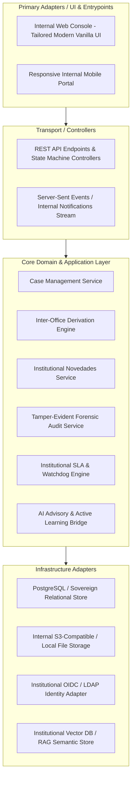
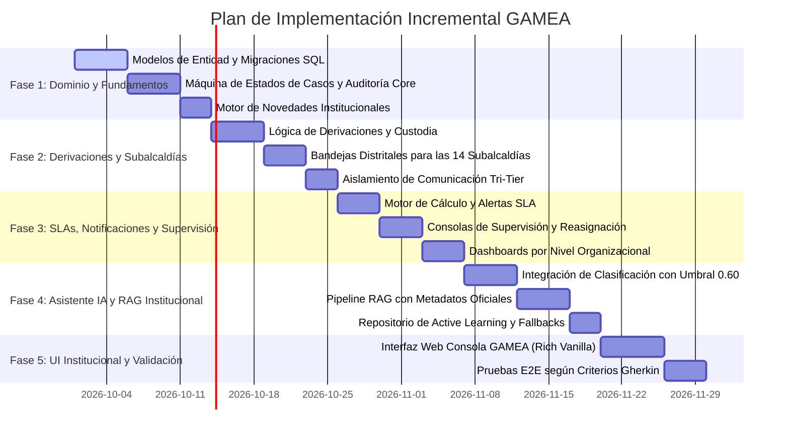

# GAMEA Internal Operations Platform — Architecture & Implementation Plan (`plan`)

**Document Version:** 1.0.0  
**Status:** Approved Architectural Blueprint  
**Governing Standard:** [constitution.md](file:///f:/Documentos/GitHub/sistemas%20soporte/constitution.md)  
**Functional Specification:** [spec.md](file:///f:/Documentos/GitHub/sistemas%20soporte/spec.md)  
**Target Organization:** Gobierno Autónomo Municipal de El Alto (GAMEA)  

---

## 1. System Architecture Overview (Hexagonal / Clean Architecture)

To enforce strict technology independence (Constitution Principle XXIII) and auditability (Principio XIII), the system adheres to a modular Clean Architecture pattern:



---

## 2. Component Breakdown & Module Directory Structure

```text
gamea-soporte/
├── constitution.md                      # Supreme Project Constitution
├── spec.md                              # Detailed Functional & Behavioral Specifications
├── plan.md                              # Architectural Blueprint & Delivery Plan
│
├── src/
│   ├── core/                            # Enterprise Domain Core (Zero external framework dependencies)
│   │   ├── entities/                    # Case, Novedad, Derivation, Dependency, SLA, Audit
│   │   ├── value-objects/               # CaseStatus, Priority, TriTierVisibility, Role
│   │   ├── ports/                       # Repository interfaces, Notifier ports, AI ports
│   │   └── use-cases/                   # CreateCase, DeriveCase, AppendNovedad, EscalateCase
│   │
│   ├── infrastructure/                  # Adapters to infrastructure and external drivers
│   │   ├── persistence/                 # Relational schema, migrations, and repository impl
│   │   ├── security/                    # RBAC/ABAC guards, JWT/Session validation
│   │   ├── storage/                     # Document attachment storage adapter
│   │   ├── audit/                       # Immutable append-only audit persistence
│   │   └── ai/                          # LLM client, prompt templates, RAG retriever, active learning
│   │
│   ├── presentation/                    # HTTP Controllers, DTOs, Serializers
│   │   ├── routes/                      # Cases, Derivations, Novedades, Subalcaldías, Admin
│   │   └── middlewares/                 # Security, tenancy/unit isolation, audit interceptor
│   │
│   └── web/                             # High-performance Internal Web Application
│       ├── index.html                   # Main single-page application entry point
│       ├── css/                         # Design system, tokens, responsive layout (Tailored Modern CSS)
│       └── js/                          # Modular controllers: inbox, case detail, derivations, dashboards
│
└── tests/                               # Gherkin Acceptance, Unit and Integration suites
    ├── unit/                            # Domain entity tests & state transitions
    ├── integration/                     # Database derivation & audit persistence tests
    └── e2e/                             # Acceptance scenarios matching spec.md
```

---

## 3. Technology Stack Justification (Sovereign & Vendor-Agnostic)

Conforme a los límites de decisión de la Constitución (Principios XXII y XXIII), se selecciona un stack de grado empresarial, ligero, mantenible y desplegable en los servidores propios del GAMEA:

1. **Backend / Servidor de Dominio:** Node.js (TypeScript) o Python (FastAPI). Se prioriza TypeScript con arquitectura limpia por su coherencia modular, tipado estricto y alto rendimiento asíncrono para streaming de eventos de auditoría y notificaciones.
2. **Base de Datos Relacional y Vectorial:** PostgreSQL 16 con extensión `pgvector`. Permite albergar de forma nativa datos transaccionales relacionales ACID, logs JSONB inmutables para auditoría y vectores de embeddings para el RAG institucional sin requerir múltiples motores de base de datos separados.
3. **Frontend Interno:** Vanilla HTML5, Vanilla CSS modular moderno y JavaScript ESModules. Sin frameworks pesados con dependencias efímeras (evitando obsolescencia tecnológica institucional); garantiza tiempos de carga instantáneos en equipos y enlaces de red de las Subalcaldías.
4. **Almacenamiento de Evidencias:** File System local securizado o MinIO (S3-compatible) con cálculo de checksums SHA-256 para integridad forense.

---

## 4. API Endpoints Specification (RESTful Contract)

### 4.1 Casos Internos
- `POST /api/v1/casos`: Crea un nuevo Caso Interno (Solicitante).
- `GET /api/v1/casos`: Lista casos según la bandeja del usuario (Personal, Unidad, Dirección, Subalcaldía).
- `GET /api/v1/casos/{id}`: Obtiene el expediente íntegro del caso (filtrado dinámicamente por la matriz de permisos RBAC/ABAC).
- `PATCH /api/v1/casos/{id}/asignar`: Asigna el caso a un funcionario técnico de la unidad.
- `POST /api/v1/casos/{id}/resolver`: Registra la solución y pasa a estado `RESUELTO`.
- `POST /api/v1/casos/{id}/cerrar`: Cierre formal y definitivo del caso (`CERRADO_CONFORME`).

### 4.2 Novedades Institucionales
- `POST /api/v1/casos/{id}/novedades`: Registra un hito formal o avance en el caso.
- `GET /api/v1/casos/{id}/novedades`: Obtiene la cronología completa de novedades.

### 4.3 Derivaciones Inter-Oficinas
- `POST /api/v1/casos/{id}/derivar`: Inicia la derivación formal hacia otra unidad o Subalcaldía.
- `POST /api/v1/derivaciones/{id}/aceptar`: La dependencia destino recepciona el caso.
- `POST /api/v1/derivaciones/{id}/rechazar`: Rechaza la derivación con fundamentación formal.

### 4.4 Colaboración y Notas
- `POST /api/v1/casos/{id}/comentarios`: Registra comentario (clasificado en `SOLICITANTE`, `INTERNO` o `NOTA_PRIVADA`).

### 4.5 Asistencia IA (Copiloto Funcionario)
- `POST /api/v1/ia/sugerir-clasificacion`: Sugiere categoría, prioridad y unidad receptora con score de confianza.
- `POST /api/v1/ia/consultar-rag`: Consulta semántica sobre normativa interna con atribución de fuentes oficiales.

---

## 5. Incremental Implementation Phases (`tasks`)



---

## 6. Risk Analysis & Mitigation Matrix

| Riesgo Técnico / Operativo | Impacto | Probabilidad | Estrategia de Mitigación Constitucional |
| :--- | :---: | :---: | :--- |
| **Resistencia al cambio en Subalcaldías** | Alto | Media | Proporcionar interfaces sumamente rápidas y limpias, con bandejas locales que respeten la autonomía distrital y reduzcan la burocracia de papel. |
| **Pérdida de conectividad en distritos alejados** | Medio | Media | Diseño web ultra-ligero (Vanilla CSS/JS, sin dependencias externas pesadas) con persistencia local de borradores y reintentos asíncronos. |
| **Filtración de notas privadas o sensibles** | Crítico | Baja | Separación física a nivel de DTO y query de base de datos; la API nunca envía campos privados a roles sin claim de supervisión/autoridad. |
| **Alucinaciones de IA en normativas municipales** | Alto | Media | Regla de Oro RAG (Principio X y XI): Si no existe fuente con hash verificado y fecha vigente, el sistema se declara incompetente y transfiere a triaje humano. |
| **Alteración de registros históricos** | Crítico | Baja | Tablas de auditoría en modo append-only con triggers de base de datos que impiden `UPDATE` y `DELETE` sobre el histórico. |
