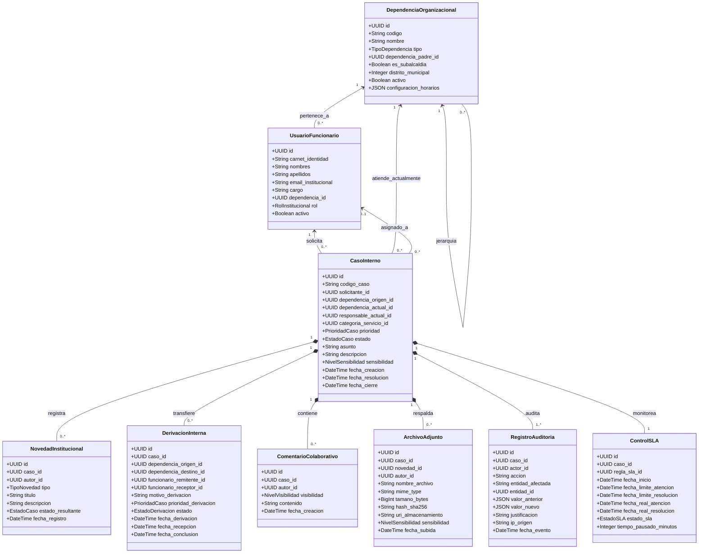
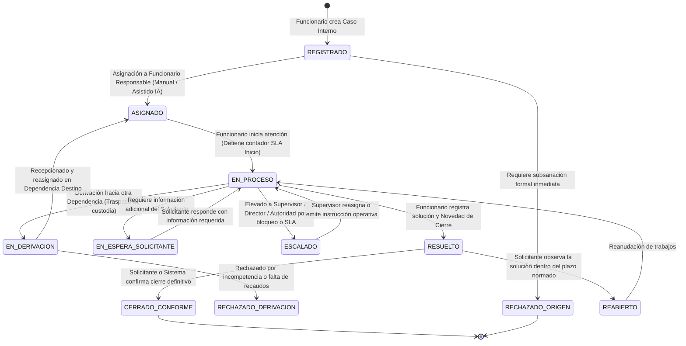
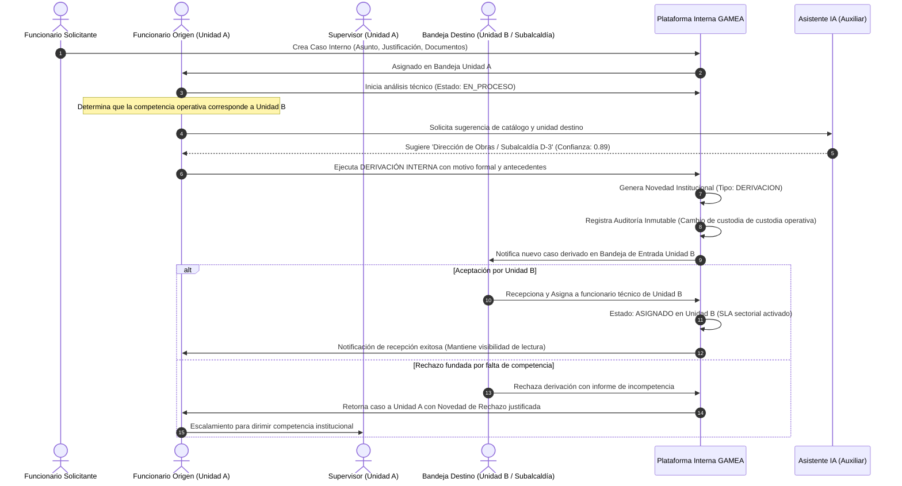
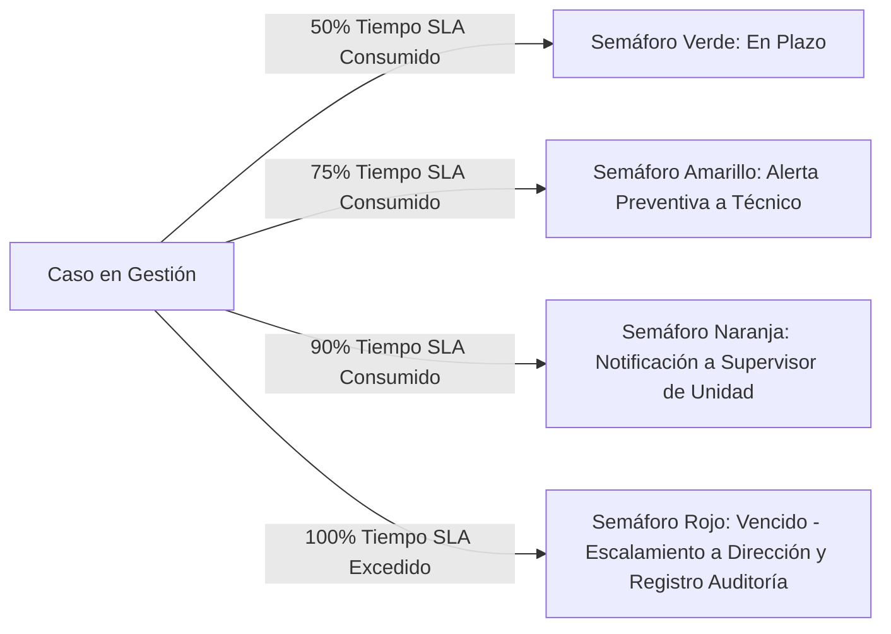

# GAMEA Internal Operations Platform — Functional & Technical Specifications (`specify`)

**Document Version:** 1.0.0  
**Status:** Approved Specification Baseline  
**Governing Standard:** [constitution.md](file:///f:/Documentos/GitHub/sistemas%20soporte/constitution.md)  
**Target Organization:** Gobierno Autónomo Municipal de El Alto (GAMEA)  

---

## 1. Domain Modeling & Entities (UML / Logical Schema)



---

## 2. BPMN 2.0 Workflows & State Machine

### 2.1 Lifecycle State Machine (`EstadoCaso`)



### 2.2 BPMN Formal Flow: Derivación Inter-Oficinas



---

## 3. Communication Tiers & Granular RBAC/ABAC Matrix

### 3.1 Strict Tri-Tier Visibility Architecture
Conforme al Principio XV de la Constitución, la plataforma aísla físicamente los datos según tres niveles de visibilidad:

| Nivel de Visibilidad | Audiencia Autorizada | Restricción Técnica |
| :--- | :--- | :--- |
| **1. Comunicación con Solicitante** | Funcionario Solicitante + Equipo Asignado | Visible en la vista del solicitante. Notificaciones directas al creador. |
| **2. Comunicación Interna** | Funcionarios y Supervisores de la Dependencia asignada | Oculto para el Solicitante. Notas técnicas, borradores y coordinaciones operativas. |
| **3. Nota Privada** | Supervisores, Directores y Auditores con clearence explícito | Encriptado o protegido con claim especial. Totalmente inaccesible para técnicos y solicitantes. |

### 3.2 Matriz de Roles Institucionales

| Rol Institucional | Ver Casos Propios | Ver Casos Unidad | Ver Casos Dirección | Ver Casos Subalcaldía | Reasignar / Intervenir | Derivar Externa | Cierre Administrativo | Acceso a Auditoría |
| :--- | :---: | :---: | :---: | :---: | :---: | :---: | :---: | :---: |
| **Funcionario Solicitante** | **R/W** | - | - | - | - | - | - | - |
| **Funcionario Técnico** | **R/W** | **R** (Bandeja) | - | - | - | **W** | - | - |
| **Supervisor de Unidad** | **R/W** | **R/W** | - | - | **W** | **W** | **W** | **R** (Unidad) |
| **Director / Jefe Depto.** | **R/W** | **R/W** | **R/W** | - | **W** | **W** | **W** | **R** (Dirección) |
| **Subalcalde / Resp. Distrital**| **R/W** | **R/W** | **R/W** | **R/W** | **W** | **W** | **W** | **R** (Subalcaldía) |
| **Autoridad Institucional** | **R** | **R** | **R** | **R** | - | - | - | **R** (Global) |
| **Auditor Interno** | **R** | **R** | **R** | **R** | - | - | - | **R/Export** |
| **Administrador Funcional** | **R** | **R** | **R** | **R** | - | - | - | **R/W** (Config) |

*Leyenda:* `R` (Lectura), `W` (Escritura/Gestión), `-` (Sin Acceso).

---

## 4. Subalcaldías as First-Class Citizens

GAMEA cuenta con una estructura territorial descentralizada compuesta por **14 Subalcaldías** (Distritos Municipales 1 al 14). La plataforma implementa para cada Subalcaldía:
1. **Identidad Organizacional Autogestionada:** Cada Subalcaldía posee su propio nodo raíz dentro del árbol de dependencias, gestionando sus propias Unidades Técnicas, Catastro Distrital, Servicios Municipales Internos y Mantenimiento.
2. **Bandeja Territorial Independiente:** Bandejas separadas por Subalcaldía con capacidad de filtrado por Distrito, Zona y Cuadrante operativo interno.
3. **Flujos de Derivación Cruzada (Central ⇄ Subalcaldía):** Protocolos formalizados para que una Subalcaldía derive requerimientos a Direcciones Centrales (ej. Jurídica, Finanzas, Planificación) y viceversa, con preservación íntegra de la cadena de custodia y SLAs específicos por distrito.

---

## 5. Enterprise AI & RAG Subsystem Specifications

### 5.1 AI Operating Principles
1. **Rol Exclusivamente Asistivo:** La IA no toma resoluciones. Asiste mediante prellenado de campos, clasificación y resúmenes.
2. **Control de Confianza (Threshold = 0.60):**
   - Si $\text{Score} \ge 0.60$: La sugerencia de clasificación o derivación se muestra al funcionario como recomendación destacada.
   - Si $\text{Score} < 0.60$: Se marca como baja confianza; el sistema solicita al usuario categorización manual o eleva a mesa de entrada/supervisor.
3. **Seguridad y Aislamiento de Contexto RAG:** Las búsquedas semánticas e inferencias sólo pueden incorporar en el prompt fragmentos de documentos a los que el funcionario solicitante tiene permiso institucional explícito.

### 5.2 Estructura de Metadatos para Documentos RAG
Todo documento normativo ingresado a la Base de Conocimiento Institucional debe contar con:
```json
{
  "documento_id": "UUID",
  "codigo_normativo": "RES-ADM-GAMEA-045/2025",
  "titulo": "Reglamento Interno de Mantenimiento de Maquinaria Pesada en Subalcaldías",
  "version": "2.1",
  "organo_emisor": "Dirección de Mantenimiento y Servicios",
  "fecha_aprobacion": "2025-03-12",
  "estado_vigencia": "VIGENTE",
  "nivel_clasificacion": "ADMINISTRATIVA",
  "unidades_autorizadas": ["SUBALCALDIA_D1", "SUBALCALDIA_D2", "DIR_MANTENIMIENTO"],
  "hash_archivo": "sha256:e3b0c44298fc1c149afbf4c8996fb92427ae41e4649b934ca495991b7852b855"
}
```

---

## 6. Service Level Agreements (SLA) & Notification Engine

### 6.1 SLA State Model & Calculation Rules
- **T1: Tiempo de Primera Atención (TPA):** Desde `fecha_creacion` hasta `fecha_inicio_atencion` (`ASIGNADO` $\to$ `EN_PROCESO`).
- **T2: Tiempo de Derivación (TD):** Tiempo transcurrido desde la emisión de la derivación hasta su formal aceptación por la unidad destino.
- **T3: Tiempo Total de Resolución (TTR):** Desde `fecha_creacion` hasta `fecha_resolucion`.
- **Pausa de SLA:** El reloj de SLA se pausa automáticamente cuando el caso pasa al estado `EN_ESPERA_SOLICITANTE` y se reanuda con el reingreso de antecedentes.

### 6.2 Matriz de Alertas Preventivas y Reactivas



---

## 7. Forensic Audit & Traceability Framework

El motor de auditoría intercepta cada mutación a nivel de capa de dominio y persiste un log estructurado append-only con la siguiente especificación:

```json
{
  "evento_auditoria_id": "9b1deb4d-3b7d-4bad-9bdd-2b0d7b3dcb6d",
  "timestamp": "2026-09-27T08:30:00.124Z",
  "actor": {
    "usuario_id": "c1f1092a-b6a8-4390-8d54-8e1efd6ef712",
    "nombre_completo": "Lic. Marco Antonio Quispe",
    "cargo": "Técnico de Mantenimiento Informático",
    "dependencia_id": "DIR-TECNOLOGIAS-INF",
    "ip_origen": "10.15.4.42"
  },
  "accion": "DERIVACION_INTERNA",
  "entidad": "CasoInterno",
  "entidad_id": "CASO-2026-00842",
  "cambios": {
    "dependencia_actual": {
      "anterior": "DIR-TECNOLOGIAS-INF",
      "nuevo": "SUBALCALDIA-D4"
    },
    "estado": {
      "anterior": "EN_PROCESO",
      "nuevo": "EN_DERIVACION"
    }
  },
  "justificacion": "Se deriva requerimiento de soporte presencial por tratarse de equipos ubicados en la sede de la Subalcaldía del Distrito 4.",
  "resultado": "EXITO"
}
```

---

## 8. Verification & Acceptance Criteria (Gherkin Scenarios)

### Scenario 1: Derivación Inter-Oficinas sin pérdida de historial
```gherkin
Feature: Derivación de Caso Interno entre Dependencias

  Scenario: Un funcionario técnico de Oficina Central deriva un caso a una Subalcaldía
    Given un Caso Interno con código "CAS-2026-0100" en estado "EN_PROCESO" en la "Dirección Jurídica"
    And el caso cuenta con 3 Novedades Institucionales y 2 documentos adjuntos
    When el funcionario "dr.flores" ejecuta la acción de derivación hacia la "Subalcaldía Distrito 8"
    And adjunta el motivo "Se deriva por corresponder a verificación técnica en territorio distrital"
    Then el estado del caso cambia a "EN_DERIVACION"
    And la custodia operativa se asigna a la bandeja de entrada de la "Subalcaldía Distrito 8"
    And las 3 Novedades y 2 documentos originales se mantienen íntegros y legibles
    And se registra una nueva Novedad de tipo "DERIVACION" con autor "dr.flores"
    And se crea un registro de auditoría inmutable de tipo "DERIVACION_INTERNA"
```

### Scenario 2: Aislamiento estricto de Notas Privadas y comunicación interna
```gherkin
Feature: Confidencialidad de Notas Privadas y Separación de Canales

  Scenario: Un funcionario solicitante intenta consultar un caso con comentarios internos
    Given un Caso Interno "CAS-2026-0150" creado por el funcionario solicitante "lic.mendoza"
    And el supervisor de la unidad añade un comentario con visibilidad "Nota Privada"
    And el técnico asignado añade un comentario con visibilidad "Comunicación Interna"
    When el funcionario "lic.mendoza" consulta el detalle del caso en su bandeja personal
    Then el sistema NO debe listar el comentario de tipo "Nota Privada"
    And el sistema NO debe listar el comentario de tipo "Comunicación Interna"
    And el sistema sólo muestra los eventos de "Comunicación con Solicitante" y Novedades públicas
```

### Scenario 3: Asistencia IA bajo control de confianza y retención de autoridad humana
```gherkin
Feature: Clasificación asistida por Inteligencia Artificial y Fallback

  Scenario: Clasificación de requerimiento interno con baja confianza del modelo
    Given un Caso Interno recién registrado con descripción ambigua sobre trámites internos
    When el motor de clasificación IA analiza el texto del caso
    And obtiene una puntuación de confianza de 0.48 (inferior al umbral institucional de 0.60)
    Then el sistema NO debe auto-derivar ni asignar el caso automáticamente
    And el sistema marca el caso con etiqueta "CLASIFICACION_REQUIERE_TRIAGE"
    And enruta el caso a la bandeja de Supervisión para asignación manual humana
    And registra el evento en el repositorio de Active Learning para recalibración
```
